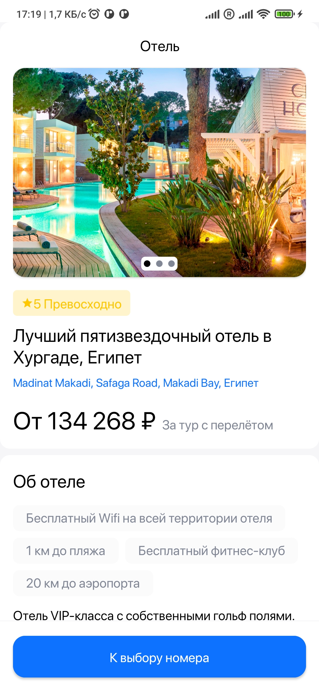
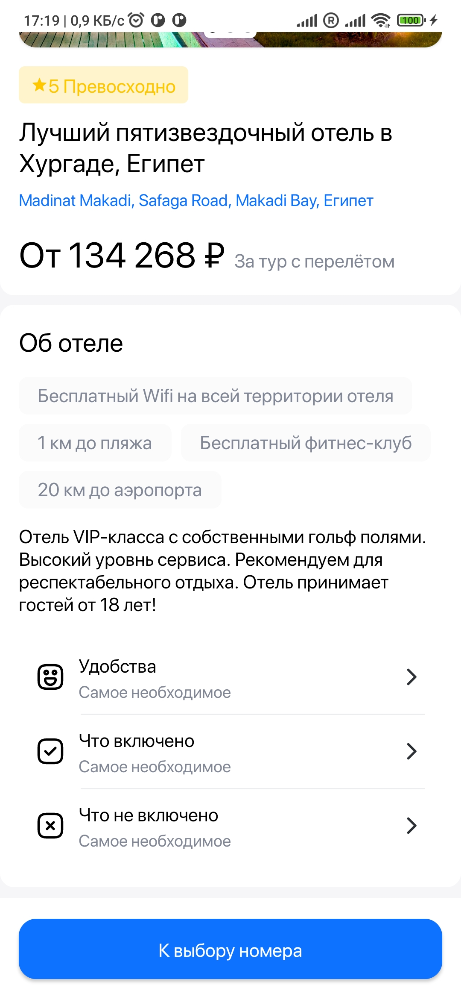
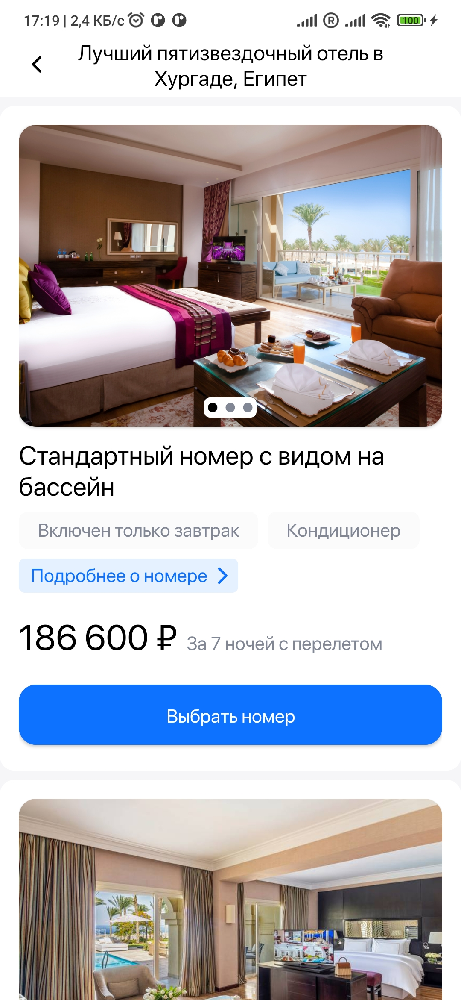
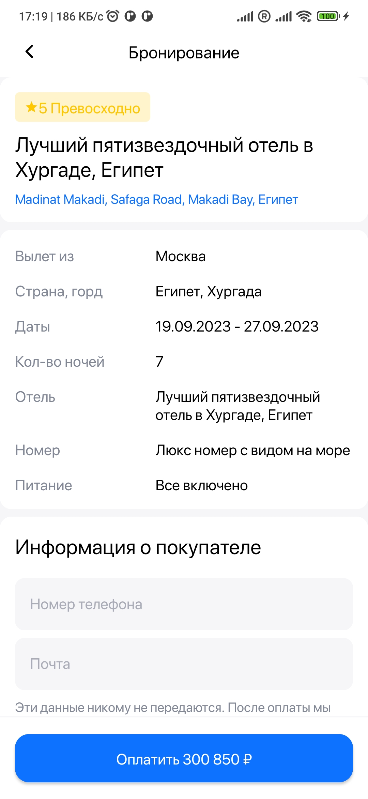
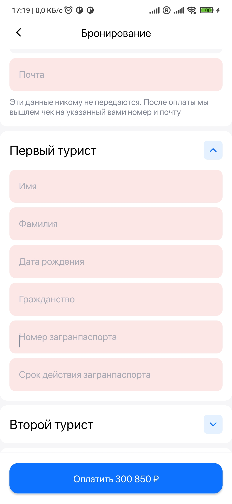

# DiscussIt

Do you like to argue? This app made for you! Chose the topic to discuss and find a person who takes an opposite position on it.

Still under development...

Made with: 
OOP 
CLEAN Architecture 
Multimodules 
Koin 
WebRTC 
DataChannel 
CompositeAdapter with payloads 
Firebase 
CustomViews 

         
